#  [Designing a Practical Degradation Model for Deep Blind Image Super-Resolution](https://arxiv.org/pdf/2103.14006.pdf)

 

[Kai Zhang](https://cszn.github.io/), Jingyun Liang, [Luc Van Gool](https://vision.ee.ethz.ch/people-details.OTAyMzM=.TGlzdC8zMjQ4LC0xOTcxNDY1MTc4.html), [Radu Timofte](http://people.ee.ethz.ch/~timofter/)  
_[Computer Vision Lab](https://vision.ee.ethz.ch/the-institute.html), ETH Zurich, Switzerland_

[[Paper](https://arxiv.org/abs/2103.14006)] [[Code](https://github.com/cszn/BSRGAN/blob/main/main_test_bsrgan.py)] [[Training Code](https://github.com/cszn/KAIR)]

_**Our new work for real image denoising ---> [https://github.com/cszn/SCUNet](https://github.com/cszn/SCUNet)**_

_**Our work is the beginning rather than the end of real image super-resolution.**_

_______
- **_News (2021-08-31)_**: We upload the training code. 
- **_News (2021-08-24)_**: We upload the BSRGAN degradation model. 
```python
from utils import utils_blindsr as blindsr
img_lq, img_hq = blindsr.degradation_bsrgan(img, sf=4, lq_patchsize=72)
```
- **_News (2021-07-23)_**: After rejection by CVPR 2021, our paper is accepted by ICCV 2021. For the sake of fairness, we will not update the trained models in our camera-ready version. However, we may update the trained models in github.
- **_News (2021-05-18)_**: Add trained BSRGAN model for scale factor 2.
- **_News (2021-04)_**: Our degradation model for face image enhancement: [https://github.com/vvictoryuki/BSRGAN_implementation](https://github.com/vvictoryuki/BSRGAN_implementation)


Training
----------
1. Download [KAIR](https://github.com/cszn/KAIR): `git clone https://github.com/cszn/KAIR.git`
2. Put your training high-quality images into `trainsets/trainH` or set `"dataroot_H": "trainsets/trainH"`
3. Train BSRNet
    1. Modify [train_bsrgan_x4_psnr.json](https://github.com/cszn/KAIR/blob/master/options/train_bsrgan_x4_psnr.json) e.g., `"gpu_ids": [0]`, `"dataloader_batch_size": 4`
    2. Training with `DataParallel`
    ```bash
    python main_train_psnr.py --opt options/train_bsrgan_x4_psnr.json
    ```
    2. Training with `DistributedDataParallel` - 4 GPUs
    ```bash
    python -m torch.distributed.launch --nproc_per_node=4 --master_port=1234 main_train_psnr.py --opt options/train_bsrgan_x4_psnr.json  --dist True
    ```
4. Train BSRGAN
    1. Put BSRNet model (e.g., '400000_G.pth') into `superresolution/bsrgan_x4_gan/models`
    2. Modify [train_bsrgan_x4_gan.json](https://github.com/cszn/KAIR/blob/master/options/train_bsrgan_x4_gan.json) e.g., `"gpu_ids": [0]`, `"dataloader_batch_size": 4`
    3. Training with `DataParallel`
    ```bash
    python main_train_gan.py --opt options/train_bsrgan_x4_gan.json
    ```
    3. Training with `DistributedDataParallel` - 4 GPUs
    ```bash
    python -m torch.distributed.launch --nproc_per_node=4 --master_port=1234 main_train_gan.py --opt options/train_bsrgan_x4_gan.json  --dist True
    ```
5. Test BSRGAN model `'xxxxxx_E.pth'` by modified `main_test_bsrgan.py`
    1. `'xxxxxx_E.pth'` is more stable than `'xxxxxx_G.pth'`


_______
✨ _**Some visual examples**_: [oldphoto2](https://imgsli.com/NDgzMjU); [butterfly](https://imgsli.com/NDgyNjY); [comic](https://imgsli.com/NDgyNzg); [oldphoto3](https://imgsli.com/NDgyNzk); [oldphoto6](https://imgsli.com/NDgyODA); [comic_01](https://imgsli.com/NDgzNTg); [comic_03](https://imgsli.com/NDgzNTk); [comic_04](https://imgsli.com/NDgzNTY)

[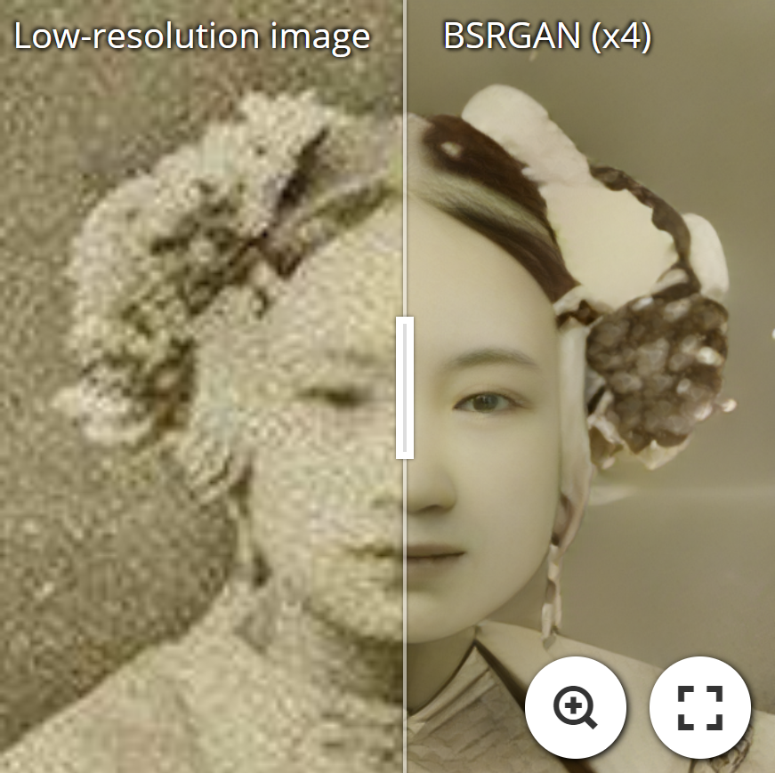](https://imgsli.com/NDgzMjU) [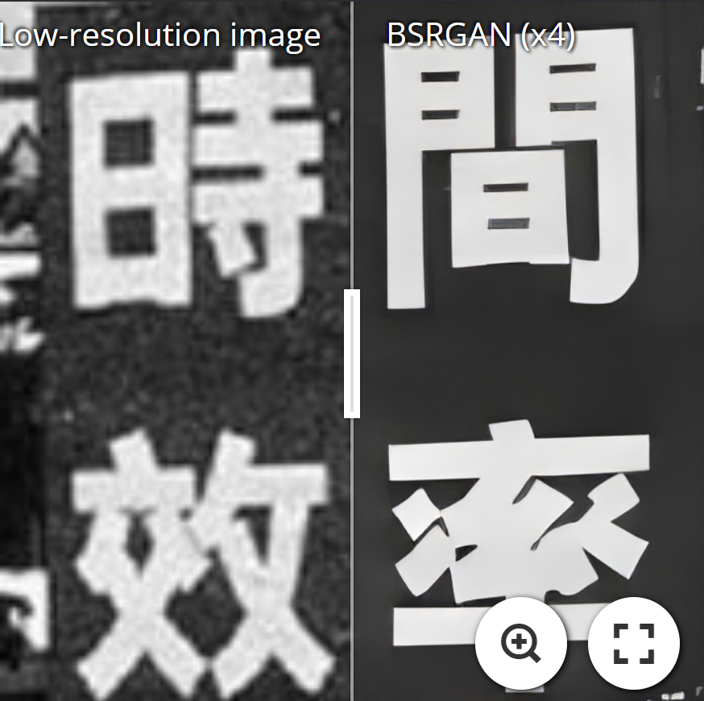](https://imgsli.com/NDgyNzk) 
[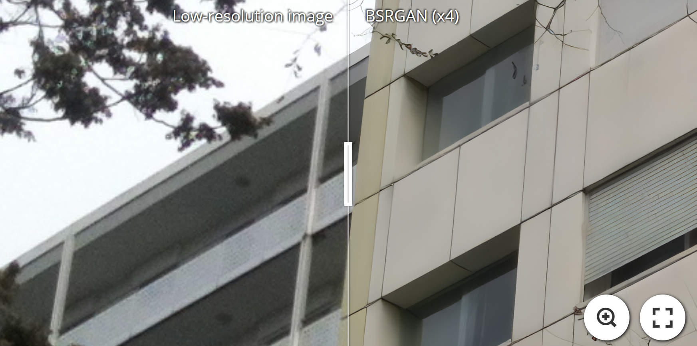](https://imgsli.com/NDgzNDk)
___________

* [Testing code](#testing-code)
* [Main idea](#main-idea)
* [Comparison](#comparison)
* [More visual results on RealSRSet dataset](#more-visual-results-on-realsrset-dataset)
* [Visual results on DPED dataset](#visual-results-on-dped-dataset)
* [Citation](#citation)
* [Acknowledgments](#acknowledgments)

Testing code
----------

* [main_test_bsrgan.py](main_test_bsrgan.py)
* [model_zoo](model_zoo) (_Download the following models from [Google drive](https://drive.google.com/drive/folders/13kfr3qny7S2xwG9h7v95F5mkWs0OmU0D?usp=sharing) or [腾讯微云](https://share.weiyun.com/5qO32s3)_).
   * Proposed:
     * BSRGAN.pth     [[Google drive]](https://drive.google.com/drive/folders/13kfr3qny7S2xwG9h7v95F5mkWs0OmU0D?usp=sharing) [[腾讯微云]](https://share.weiyun.com/7GPI8p7x)🌱
     * BSRNet.pth      [[Google drive]](https://drive.google.com/drive/folders/13kfr3qny7S2xwG9h7v95F5mkWs0OmU0D?usp=sharing)  [[腾讯微云]](https://share.weiyun.com/VOFW5Ela)🌱
   * Compared methods:
     * RRDB.pth  --->  [original link](https://github.com/xinntao/ESRGAN)
     * ESRGAN.pth --->   [original link](https://github.com/xinntao/ESRGAN)
     * FSSR_DPED.pth --->   [original link](https://github.com/ManuelFritsche/real-world-sr)
     * FSSR_DPED.pth --->   [original link](https://github.com/ManuelFritsche/real-world-sr)
     * RealSR_DPED.pth --->   [original link](https://github.com/jixiaozhong/RealSR)
     * RealSR_JPEG.pth --->   [original link](https://github.com/jixiaozhong/RealSR)


Main idea
----------

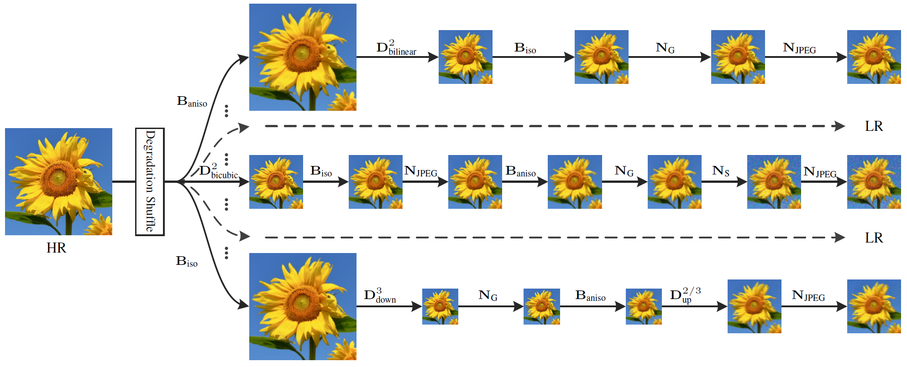 

__Design a new degradation model to synthesize LR images for training:__

* **_1) Make the blur, downsampling and noise more practical_**
  * **_Blur:_** _two convolutions with isotropic and anisotropic Gaussian kernels from both the HR space and LR space_
  * **_Downsampling:_** _nearest, bilinear, bicubic, down-up-sampling_
  * **_Noise:_** _Gaussian noise, JPEG compression noise, processed camera sensor noise_
* **_2) Degradation shuffle:_** _instead of using the commonly-used blur/downsampling/noise-addition pipeline, we perform randomly shuffled degradations to synthesize LR images_

__Some notes on the proposed degradation model:__

* *The degradation model is mainly designed to synthesize degraded LR images. Its most direct application is to train a deep blind super-resolver with paired LR/HR images. In particular, the degradation model can be performed on a large dataset of HR images to produce unlimited perfectly aligned training images, which typically do not suffer from the limited data issue of laboriously collected paired data and the misalignment issue of unpaired training data.*
 
* *The degradation model tends to be unsuited to model a degraded LR image as it involves too many degradation parameters and also adopts a random shuffle strategy.*

* *The degradation model can produce some degradation cases that rarely happen in real-world scenarios, while this can still be expected to improve the generalization ability of the trained deep blind super-resolver.*

* *A DNN with large capacity has the ability to handle different degradations via a single model. This has been validated multiple times. For example, DnCNN is able
to handle SISR with different scale factors, JPEG compression deblocking with different quality factors and denoising for a wide range of noise levels, while still having a performance comparable to VDSR for SISR. It is worth noting that even when the super-resolver reduces the performance for unrealistic bicubic downsampling, it is still a preferred choice for real SISR.*

* *One can conveniently modify the degradation model by changing the degradation parameter settings and adding more reasonable degradation
types to improve the practicability for a certain application.*


Comparison
----------


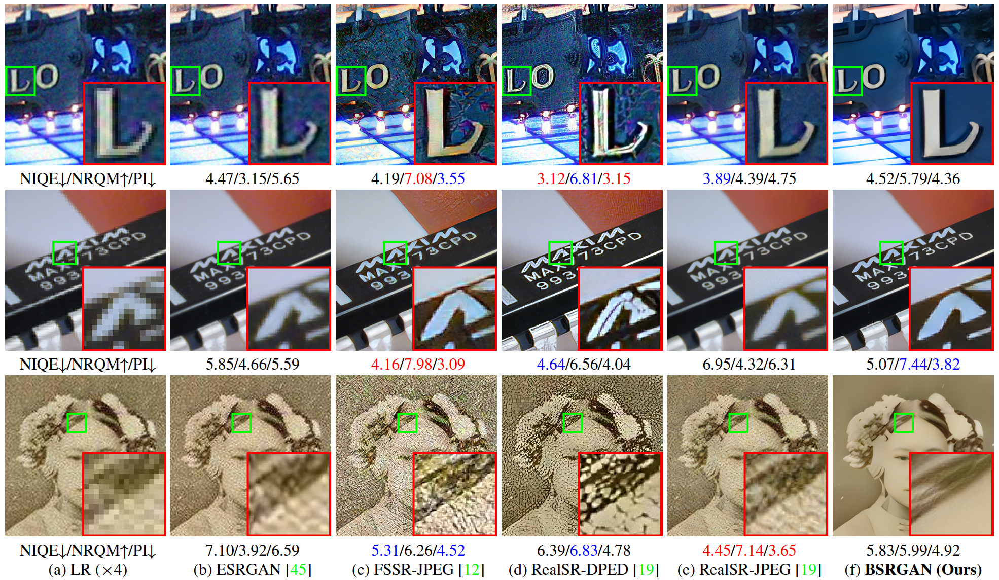 

*These no-reference IQA metrics, i.e., NIQE, NRQM and PI, do not always match perceptual visual quality [1] and the IQA metric should be updated with new SISR methods [2]. We further argue that the IQA metric for SISR should also be updated with new image degradation types, which we leave for future work.*

```
[1] "NTIRE 2020 challenge on real-world image super-resolution: Methods and results." CVPRW, 2020.
[2] "PIPAL: a large-scale image quality assessment dataset for perceptual image restoration." ECCV, 2020.
```


More visual results on [RealSRSet](testsets/RealSRSet) dataset
----------


**Left**: [real images](https://github.com/cszn/BSRNet/tree/main/testsets/RealSRSet) **|** **Right**: [super-resolved images with scale factor 4](https://github.com/cszn/BSRNet/tree/main/testsets/BSRGAN)

 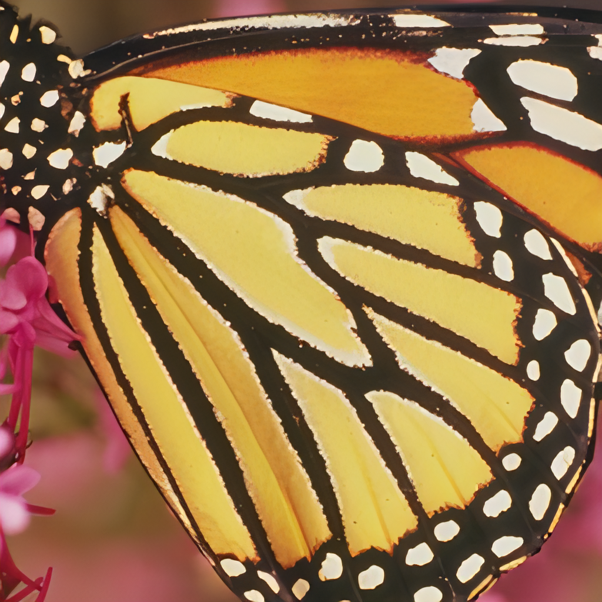

 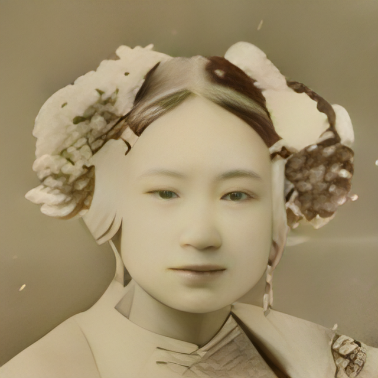

 

 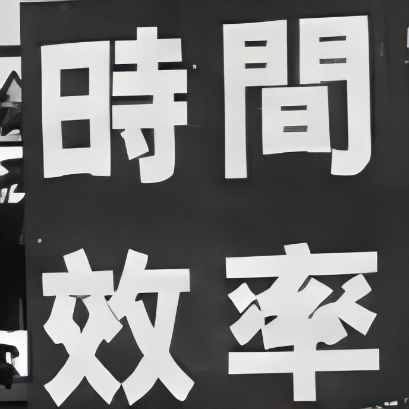

 

 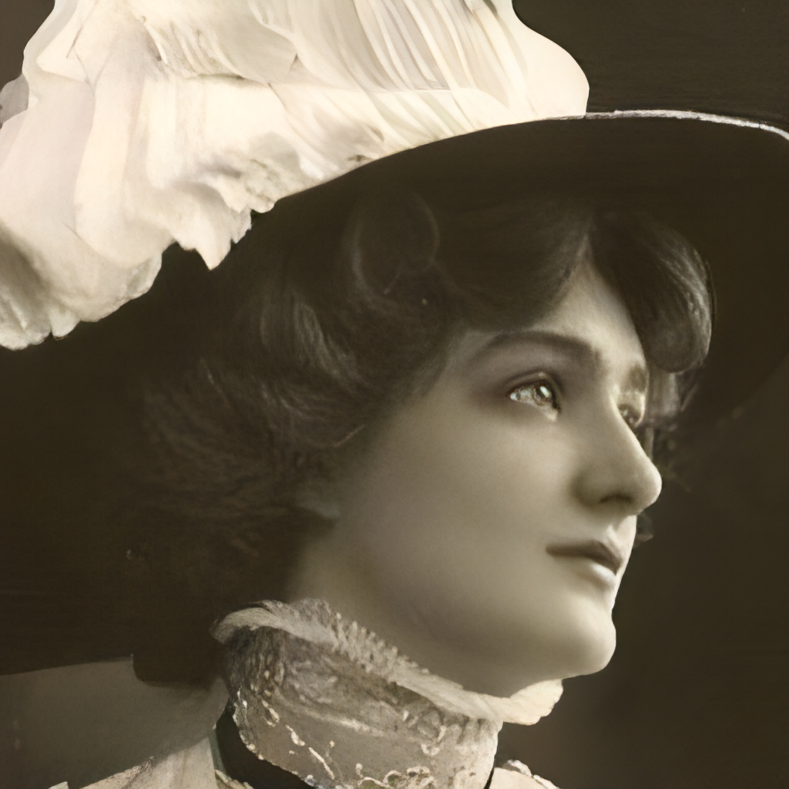

 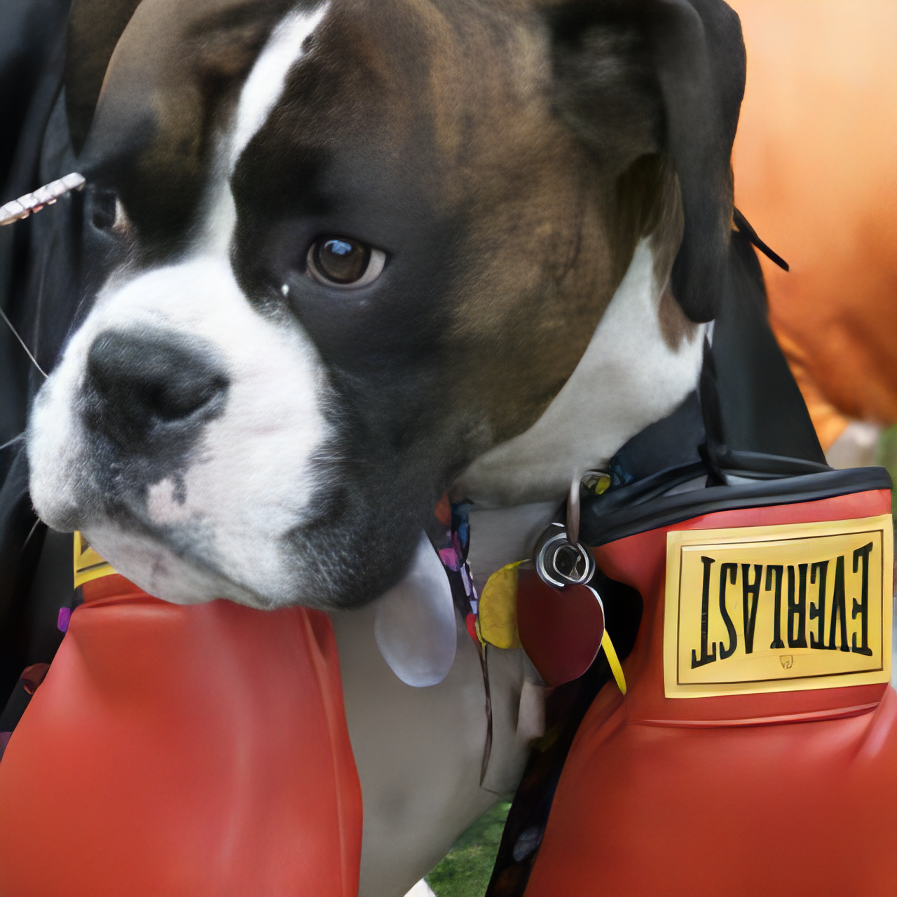

 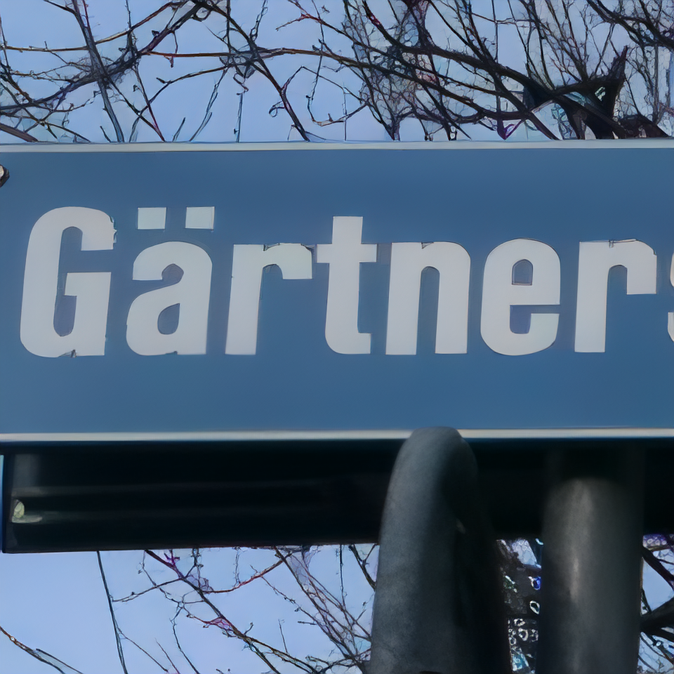

 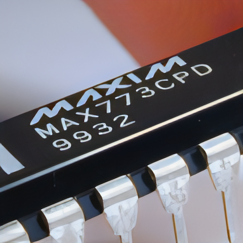

 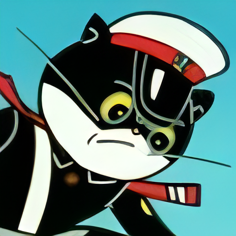

 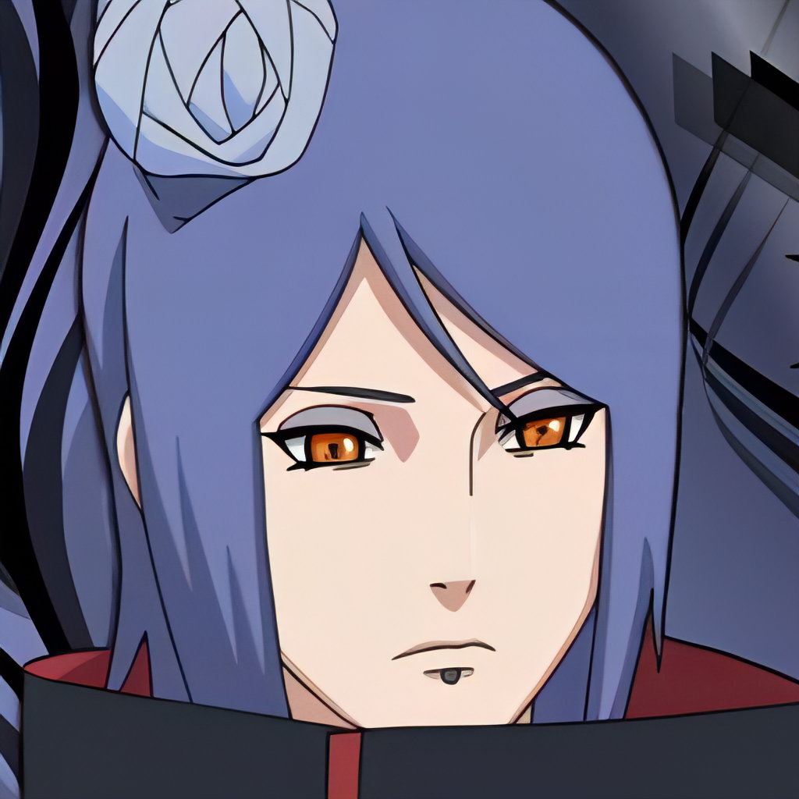

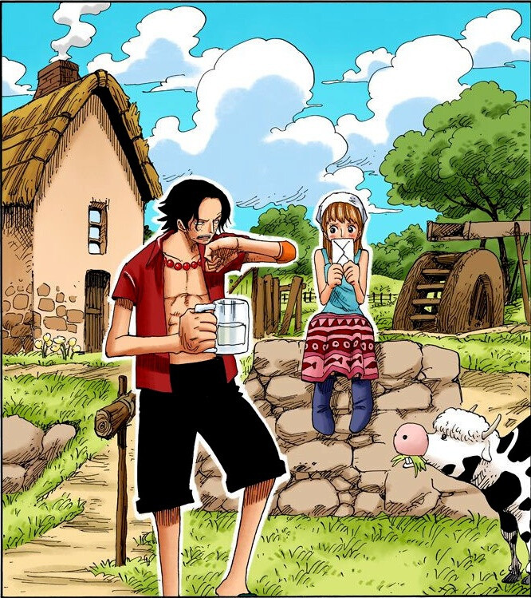 


Visual results on DPED dataset
----------

 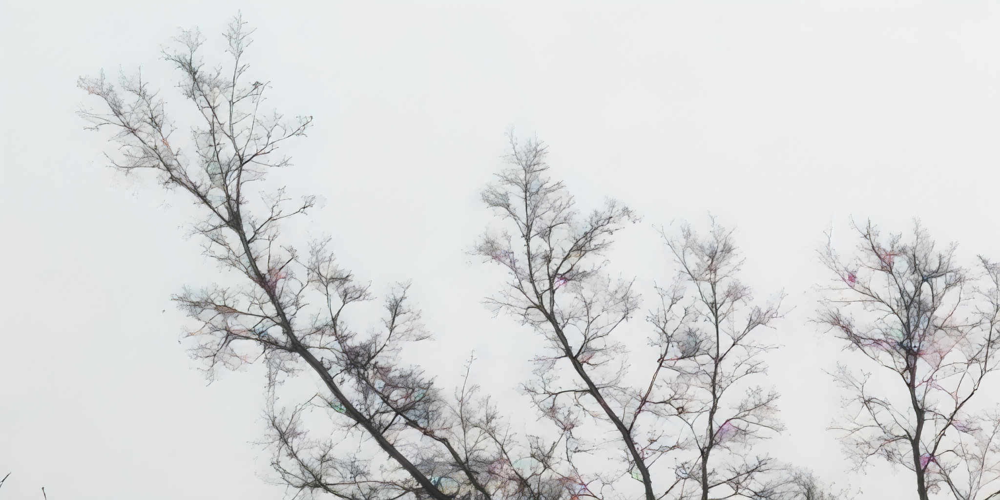

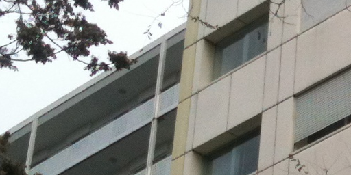 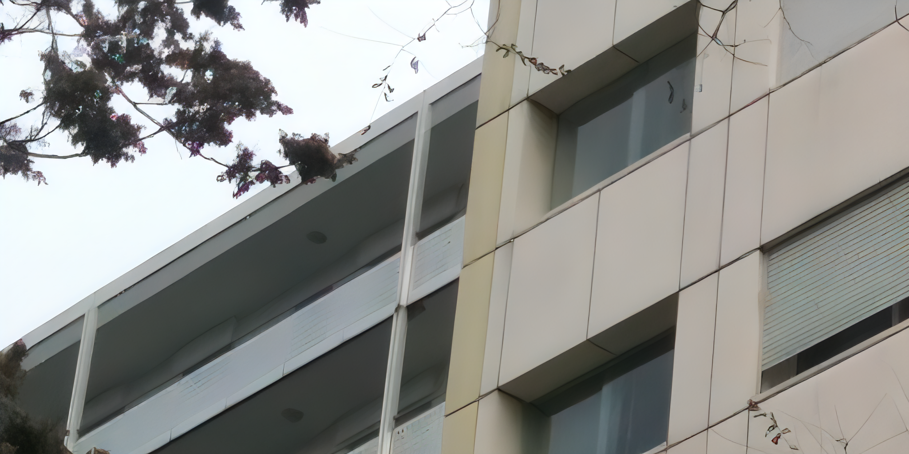

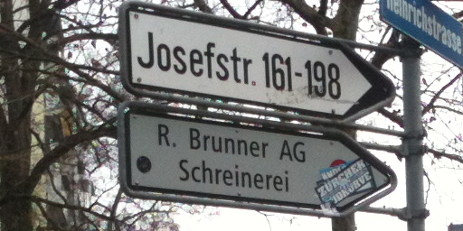 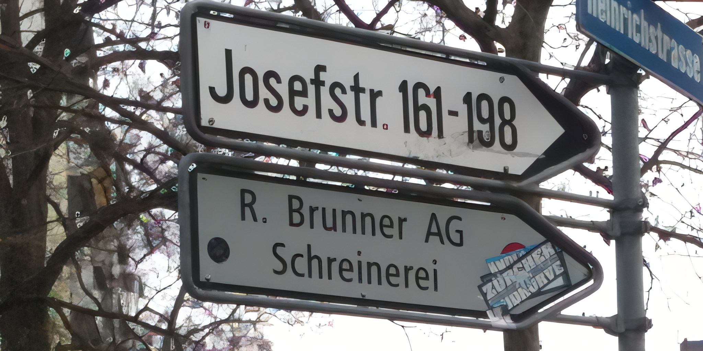

*Without using any prior information of DPED dataset for training, our BSRGAN still performs well.*


Citation
----------
```BibTex
@inproceedings{zhang2021designing,
    title={Designing a Practical Degradation Model for Deep Blind Image Super-Resolution},
    author={Zhang, Kai and Liang, Jingyun and Van Gool, Luc and Timofte, Radu},
    booktitle={IEEE International Conference on Computer Vision},
    pages={4791--4800},
    year={2021}
}
```


Acknowledgments
----------
This work was partly supported by the ETH Zurich Fund (OK), a Huawei Technologies Oy (Finland) project, and an Amazon AWS grant.


